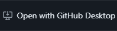
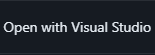

# BetaFortressClient

## About Beta Fortress Client
Beta Fortress Client is a .NET 8 program (originally based on .NET Framework) for installing, updating, resetting and even uninstalling Beta Fortress.

## NuGet packages/third-party code used
[Squirrel.Windows](https://github.com/squirrel/Squirrel.Windows) \
[LibGit2Sharp](https://github.com/libgit2/LibGit2Sharp) - [the modified version](https://github.com/andersklepaker/libgit2sharp) 

## How to build the source code?
**Requirements**
- Visual Studio 2022 [Community](https://visualstudio.microsoft.com/thank-you-downloading-visual-studio/?sku=Community&channel=Release&version=VS2022&source=VSLandingPage&cid=2030&passive=false) (or [Professional](https://visualstudio.microsoft.com/thank-you-downloading-visual-studio/?sku=Professional&channel=Release&version=VS2022&source=VSLandingPage&cid=2030&passive=false)) Edition with .NET desktop development
- .NET 8 [SDK x64](https://dotnet.microsoft.com/en-us/download/dotnet/thank-you/sdk-8.0.301-windows-x64-installer) and [Runtime x64](https://dotnet.microsoft.com/en-us/download/dotnet/thank-you/runtime-desktop-8.0.6-windows-x64-installer) (Install the x86 one if your compiling in 32-bit)
- [GitHub Desktop](https://desktop.github.com) (optional)

**If NuGet packages are missing from the project, you might try to restore them**

**STEP #1** \
Clone the repository with Visual Studio or GitHub Desktop \
(You can directly open the repository with Visual Studio and GitHub Desktop by pressing the  button and then  or )

**STEP #2** \
Once the cloning process is done, open the directory of where you've cloned the source code and open the BetaFortressClient(.sln) solution

**STEP #3** \
Once your inside of Visual Studio with the solution opened up, you can now make your changes. To build, press `CTRL + SHIFT + B` or right-click on the solution from the Solution Explorer and then `Build Solution`.

You can find classes and definitions of Beta Fortress Client's code here: https://github.com/AridityTeam/BetaFortressClient/tree/master/docs/code-references.md

And that concludes the tutorial on how to build Beta Fortress Client. Hope this helps you on setting up your development environment for .NET or build the source code of Beta Fortress Client!
